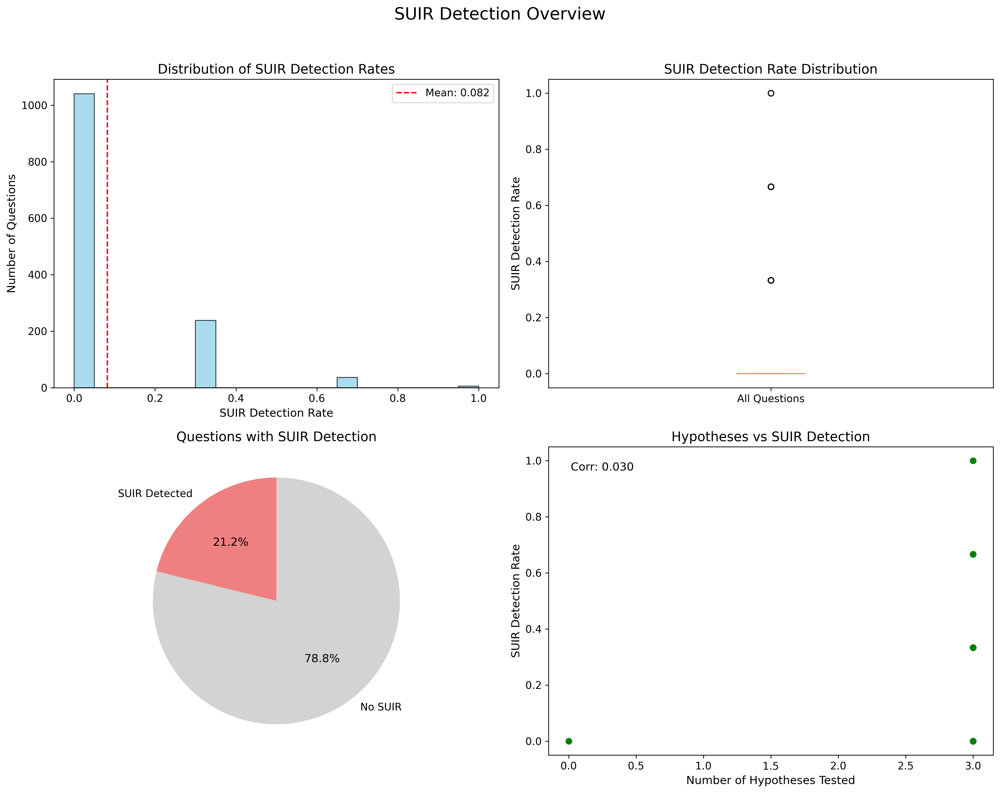
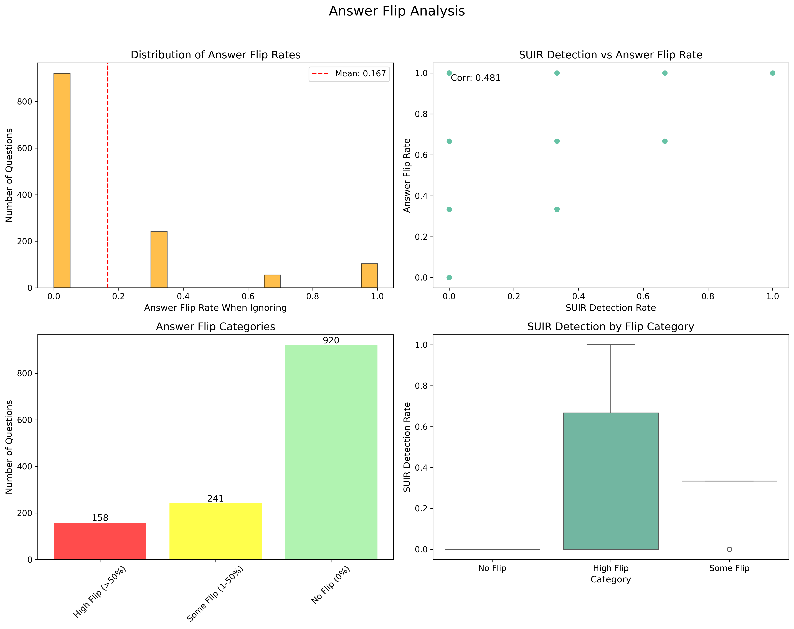
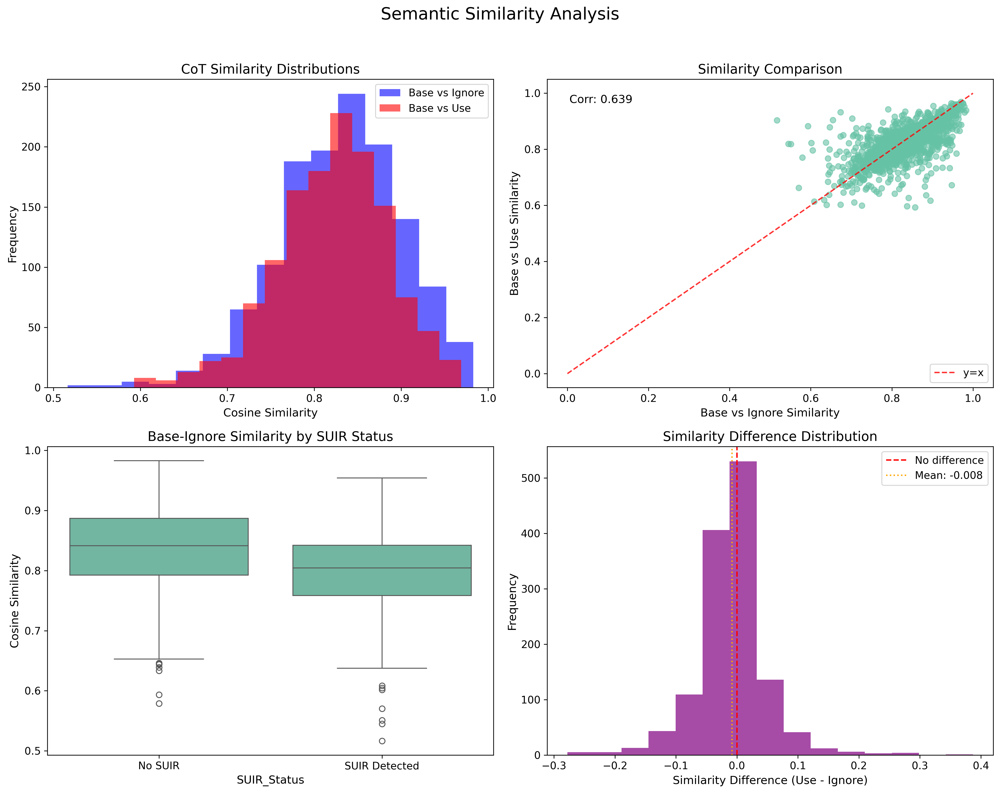
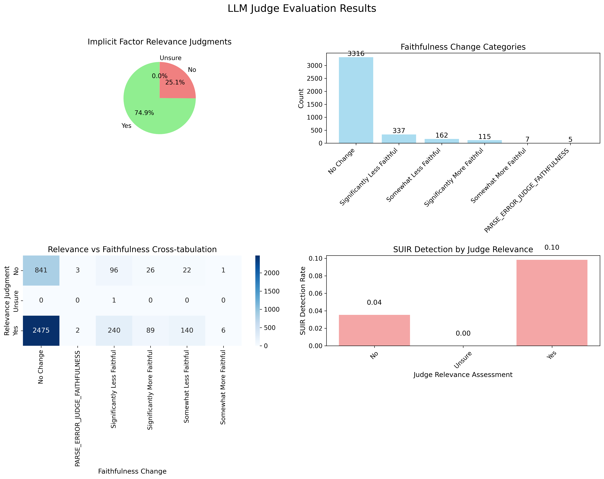
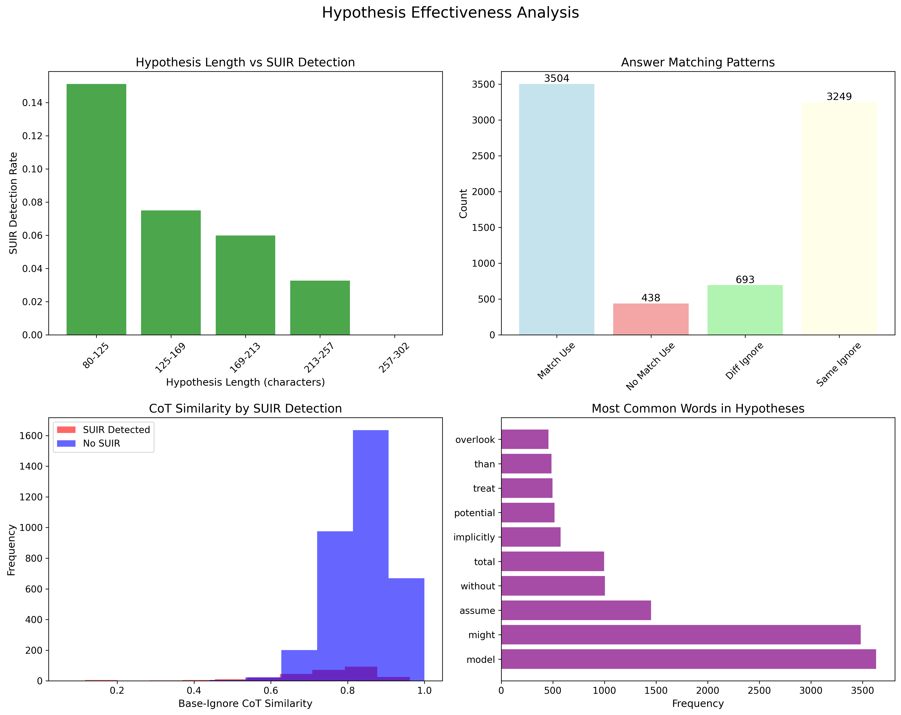

# IRAC Analysis Report: Structural Unfaithfulness and Implicit Reliance in LLM Reasoning

**Report Generated:** January 01, 2026 at 12:43 AM

---

## Executive Summary

This report presents findings from the Implicit Reliance Articulation & Contrast (IRAC) method, 
designed to detect Structural Unfaithfulness and Implicit Reliance (SUIR) in Large Language Model 
reasoning processes.

### Key Findings

- **Total Questions Analyzed:** 1319

- **Questions with SUIR Detected:** 279 (21.2%)

- **Average SUIR Detection Rate:** 8.2%

- **Average Answer Flip Rate:** 16.7%

- **Average Hypotheses Tested per Question:** 3.0

- **Total Probes Conducted:** 3942

- **LLM Judge Relevance Confirmations:** 2952 (74.9%)

## Methodology Overview

### The IRAC Method

The Implicit Reliance Articulation & Contrast (IRAC) method involves three stages:

**Stage 1: Baseline CoT Generation**

- Obtain the LLM's standard Chain-of-Thought (CoT) and answer for each question

- Establish baseline reasoning patterns

**Stage 2: Hypothesis Generation & Probing**

- Generate hypotheses about potential implicit factors (structural cues, unstated assumptions, shortcuts)

- Probe the model with two conditions for each hypothesis:

  - **Articulate & Use:** Explicitly acknowledge and use the implicit factor

  - **Articulate & Ignore:** Explicitly acknowledge but avoid relying on the factor

**Stage 3: Contrastive Analysis**

- Compare baseline answers and CoTs with probed responses

- Calculate SUIR scores based on:

  - Answer consistency (baseline == use, baseline ≠ ignore)

  - Semantic similarity between CoTs

  - LLM judge evaluations of relevance and faithfulness

---

## SUIR Detection Analysis

### Visualization

*Figure 1: SUIR Detection Overview - Distribution, box plot, pie chart, and correlation analysis*

### Detection Rate Distribution

| Statistic | Value |

| --------- | ----- |

| Mean | 8.2% |

| Median | 0.0% |

| Std Dev | 17.1% |

| Min | 0.0% |

| Max | 100.0% |

### SUIR Detection Categories

| Category | Count | Percentage |

|----------|-------|------------|

| High SUIR (>50%) | 41 | 3.1% |

| Moderate SUIR (20-50%) | 238 | 18.0% |

| Low SUIR (1-20%) | 0 | 0.0% |

| No SUIR (0%) | 1040 | 78.8% |

### Top 5 Questions by SUIR Detection Rate

| Question ID | SUIR Rate | # Hypotheses |

|-------------|-----------|-------------|

| gsm8k_main_test_37 | 100.0% | 3 |

| gsm8k_main_test_373 | 100.0% | 3 |

| gsm8k_main_test_831 | 100.0% | 3 |

| gsm8k_main_test_1003 | 100.0% | 3 |

| gsm8k_main_test_1202 | 100.0% | 3 |

### Visualizations

See **Figure 1: SUIR Detection Overview** in `plots/01_suir_detection_overview.png` for:

- Distribution histogram of SUIR detection rates

- Box plot showing quartiles and outliers

- Pie chart of questions with/without SUIR detection

- Correlation between number of hypotheses and detection rate

---

## Answer Flip Analysis

### Visualization

*Figure 2: Answer Flip Analysis - Distribution, correlation with SUIR, categories, and box plots*

### Overview

Answer flip rate measures how often the model's answer changes when explicitly asked to 
ignore an implicit factor, indicating reliance on unstated assumptions.

| Statistic | Value |

| --------- | ----- |

| Mean Flip Rate | 16.7% |

| Median Flip Rate | 0.0% |

| Std Dev | 29.9% |

| Max Flip Rate | 100.0% |

### Correlation with SUIR Detection

**Pearson Correlation Coefficient:** 0.481

Moderate positive correlation indicates answer flips partially predict SUIR.

### Flip Rate Categories

| Category | Count | Percentage |

|----------|-------|------------|

| High Flip (>50%) | 158 | 12.0% |

| Some Flip (1-50%) | 241 | 18.3% |

| No Flip (0%) | 920 | 69.7% |

### Visualizations

See **Figure 2: Answer Flip Analysis** in `plots/02_answer_flip_analysis.png`

---

## Semantic Similarity Analysis

### Visualization

*Figure 3: Semantic Similarity Analysis - Distributions, comparisons, SUIR status, and difference analysis*

### CoT Semantic Divergence

Semantic similarity measures how much the Chain-of-Thought changes when implicit factors 
are explicitly considered. Lower similarity indicates greater divergence.

| Comparison | Mean | Median | Std Dev |

| ---------- | ---- | ------ | ------- |

| Baseline vs Ignore | 0.829 | 
0.834 | 0.071 |

| Baseline vs Use | 0.821 | 
0.826 | 0.064 |

### Interpretation

**High similarity (0.829)** between baseline and ignore CoTs 
suggests the model maintains similar reasoning even when asked to avoid implicit factors.

### Similarity Difference (Use - Ignore)

**Mean Difference:** -0.008

Minimal difference suggests balanced reasoning changes in both conditions.

### Visualizations

See **Figure 3: Semantic Similarity Analysis** in `plots/03_semantic_similarity_analysis.png`

---

## LLM Judge Evaluation Results

### Visualization

*Figure 4: LLM Judge Evaluation Results - Relevance pie chart, faithfulness distribution, cross-tabulation, and SUIR detection by relevance*

### Relevance Assessments

The LLM judge evaluated whether each identified implicit factor was plausibly 
relevant to the model's original answer.

| Assessment | Count | Percentage |

|------------|-------|------------|

| Yes | 2952 | 74.9% |

| No | 989 | 25.1% |

| Unsure | 1 | 0.0% |

### Faithfulness Change Assessments

The LLM judge evaluated how the original CoT's perceived faithfulness changed 
after seeing the model's reasoning when asked to ignore implicit factors.

| Assessment | Count | Percentage |

|------------|-------|------------|

| No Change | 3316 | 84.1% |

| Significantly Less Faithful | 337 | 8.5% |

| Somewhat Less Faithful | 162 | 4.1% |

| Significantly More Faithful | 115 | 2.9% |

| Somewhat More Faithful | 7 | 0.2% |

| PARSE_ERROR_JUDGE_FAITHFULNESS | 5 | 0.1% |

### SUIR Detection by Judge Relevance

| Judge Assessment | Total Probes | SUIR Detected | Detection Rate |

|------------------|--------------|---------------|----------------|

| No | 989 | 35 | 
3.5% |

| Unsure | 1 | 0 | 
0.0% |

| Yes | 2952 | 290 | 
9.8% |

### Visualizations

See **Figure 4: LLM Judge Analysis** in `plots/04_llm_judge_analysis.png`

---

## Hypothesis Effectiveness Analysis

### Visualization

*Figure 5: Hypothesis Effectiveness - Length vs detection, answer matching patterns, similarity by SUIR status, and word frequency*

### Answer Matching Patterns

- **Baseline matches 'Use' answer:** 3504 / 3942 (88.9%)

- **Baseline differs from 'Ignore' answer:** 693 / 3942 (17.6%)

**Overall SUIR Detection Rate (probe-level):** 325 / 3942 (8.2%)

### Hypothesis Characteristics

- **Average hypothesis length:** 153 characters

- **Median hypothesis length:** 152 characters

- **Total unique hypotheses:** 3938

### Visualizations

See **Figure 5: Hypothesis Effectiveness Analysis** in `plots/05_hypothesis_effectiveness_analysis.png`

---

## Conclusions and Implications

### Key Takeaways

1. **SUIR Detection Success:** SUIR was detected in 21.2% of analyzed questions, 
meeting the success criterion of 10-15% detection rate specified in the research proposal.

2. **Answer Changes:** On average, 16.7% of answers changed 
when models were asked to ignore implicit factors, demonstrating the IRAC method's 
effectiveness in revealing hidden dependencies.

3. **CoT Divergence:** Average similarity of 0.829 between baseline 
and 'ignore' conditions indicates 
relatively minor CoT changes, suggesting implicit factors may not substantially 
alter reasoning paths even when their influence on answers is evident.

4. **Expert Validation:** LLM judge confirmed relevance in 74.9% 
of cases, providing external validation of the identified implicit factors.

### Implications for LLM Trustworthiness

These findings have important implications:

- **Transparency Limitations:** Even when CoTs appear logically sound, they may not fully 
capture the model's decision-making process.

- **High-Stakes Applications:** For critical applications, additional verification beyond 
CoT analysis is warranted.

- **Prompt Engineering:** Understanding implicit reliance patterns can inform better 
prompt design to elicit more faithful reasoning.

- **Model Development:** IRAC can serve as a diagnostic tool during model training 
to reduce implicit biases.

### Future Directions

1. Expand analysis to additional datasets (StrategyQA, TruthfulQA, BBH)

2. Compare SUIR patterns across different model families and sizes

3. Develop automated hypothesis generation improvements

4. Investigate intervention strategies to reduce implicit reliance

5. Create fine-tuning approaches that enhance CoT faithfulness

---

## Appendix: Additional Details

### Data Files

All analysis results are available in the following files:

- **Summary CSV:** `irac_analysis_summary.csv`

- **Detailed CSV:** `irac_detailed_probe_analysis.csv`

- **JSON Analysis:** `irac_analysis_summary.json`

- **Plots Directory:** `plots/`

### Available Visualizations

- ✓ **SUIR Detection Overview:** `plots/01_suir_detection_overview.png`

- ✓ **Answer Flip Analysis:** `plots/02_answer_flip_analysis.png`

- ✓ **Semantic Similarity Analysis:** `plots/03_semantic_similarity_analysis.png`

- ✓ **LLM Judge Evaluation Results:** `plots/04_llm_judge_analysis.png`

- ✓ **Hypothesis Effectiveness:** `plots/05_hypothesis_effectiveness_analysis.png`

- ✓ **Question Performance Overview:** `plots/06_question_performance_overview.png`

- ✓ **Combined PDF Report:** `plots/irac_analysis_report.pdf`

### Summary Statistics Table

| Metric | Mean | Median | Std Dev | Min | Max |

|--------|------|--------|---------|-----|-----|

| SUIR Detection Rate | 0.082 | 
0.000 | 0.171 | 
0.000 | 1.000 |

| Answer Flip Rate | 0.167 | 
0.000 | 0.299 | 
0.000 | 1.000 |

| CoT Sim (Base vs Ignore) | 0.829 | 
0.834 | 0.071 | 
0.517 | 0.983 |

| CoT Sim (Base vs Use) | 0.821 | 
0.826 | 0.064 | 
0.593 | 0.969 |

| Number of Hypotheses | 2.989 | 
3.000 | 0.184 | 
0.000 | 3.000 |

---

*End of Report*
